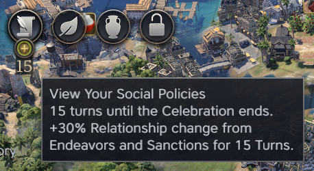
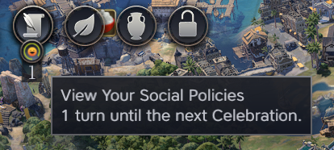

# BobobUnicorn's UI Tweaks

This is essentially a small collection of minor UI issues that have affected me during normal gameplay and will be updated occasionally.

Version compatibility: 1.0.3

## Currently Implemented

- adds a visible countdown/counter for Celebrations

Note: it doesn't seem currently easily possible to determine which type of celebration bonus you've selected. This is marked as a future improvement.

- adds an icon on the diplomacy ribbon when a civ is neutral toward you

